# election-2024-results
Line graphs of all states for the 2024 election.

Simply runs [data.py](./data.py) every minute to create a SQLite DB, followed by [line_graphs.py](./line_graphs.py) every 5 minutes to update images.

Information is downloaded every minute from the same source as Axios (the data that feeds into https://www.axios.com/visuals/election-results-2024-live-updates-map).

## Results

| _ | _| _| _ | _| _| _|
|----------|----------|----------|----------|----------|----------|----------|
| [Alabama](#alabama) | [Alaska](#alaska) | [Arizona](#arizona) | [Arkansas](#arkansas) | [California](#california) | [Colorado](#colorado) | [Connecticut](#connecticut) |
| [Delaware](#delaware) | [District of Columbia](#district-of-columbia) | [Florida](#florida) | [Georgia](#georgia) | [Hawaii](#hawaii) | [Idaho](#idaho) | [Illinois](#illinois) |
| [Indiana](#indiana) | [Iowa](#iowa) | [Kansas](#kansas) | [Kentucky](#kentucky) | [Louisiana](#louisiana) | [Maine](#maine) | [Maryland](#maryland) |
| [Massachusetts](#massachusetts) | [Michigan](#michigan) | [Minnesota](#minnesota) | [Mississippi](#mississippi) | [Missouri](#missouri) | [Montana](#montana) | [Nebraska](#nebraska) |
| [Nevada](#nevada) | [New Hampshire](#new-hampshire) | [New Jersey](#new-jersey) | [New Mexico](#new-mexico) | [New York](#new-york) | [North Carolina](#north-carolina) | [North Dakota](#north-dakota) |
| [Ohio](#ohio) | [Oklahoma](#oklahoma) | [Oregon](#oregon) | [Pennsylvania](#pennsylvania) | [Rhode Island](#rhode-island) | [South Carolina](#south-carolina) | [South Dakota](#south-dakota) |
| [Tennessee](#tennessee) | [Texas](#texas) | [Utah](#utah) | [Vermont](#vermont) | [Virginia](#virginia) | [Washington](#washington) | [West Virginia](#west-virginia) |
| [Wisconsin](#wisconsin) | [Wyoming](#wyoming) | | | | | |

### Alabama
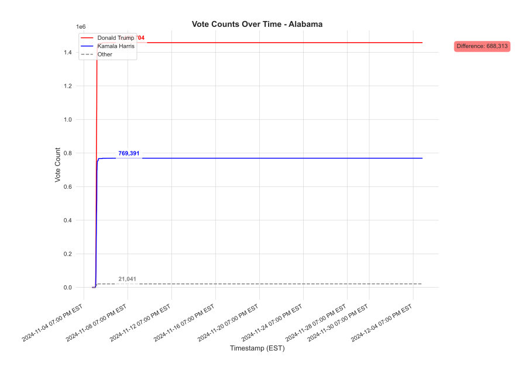

### Alaska

### Arizona

### Arkansas

### California

### Colorado
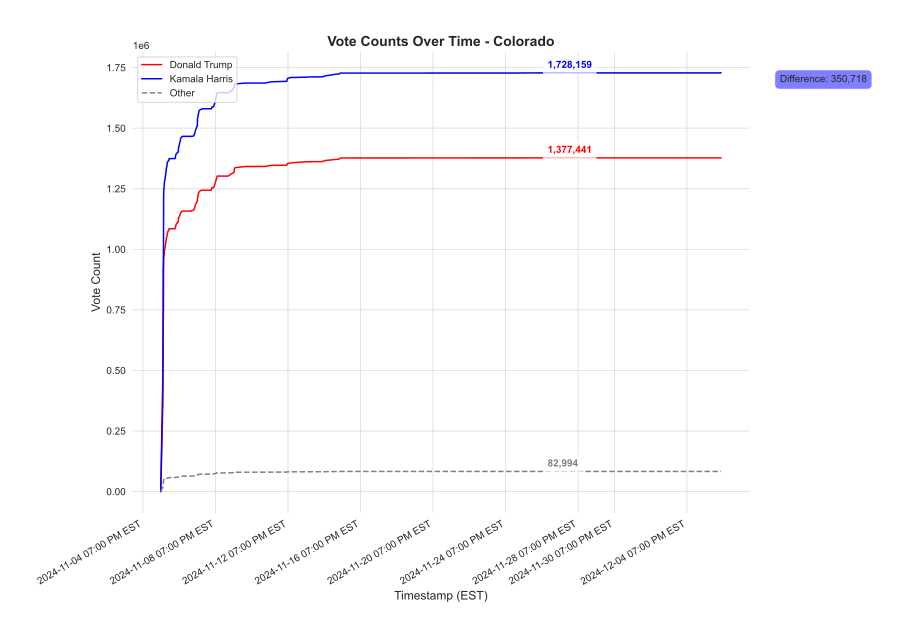

### Connecticut

### Delaware
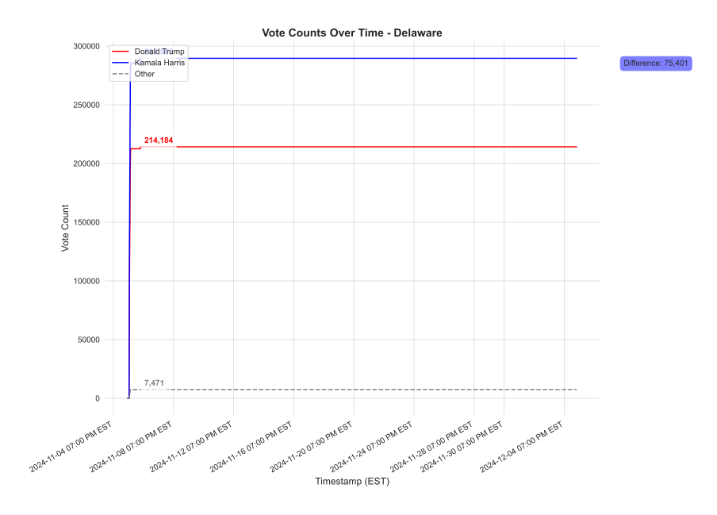

### District of Columbia

### Florida
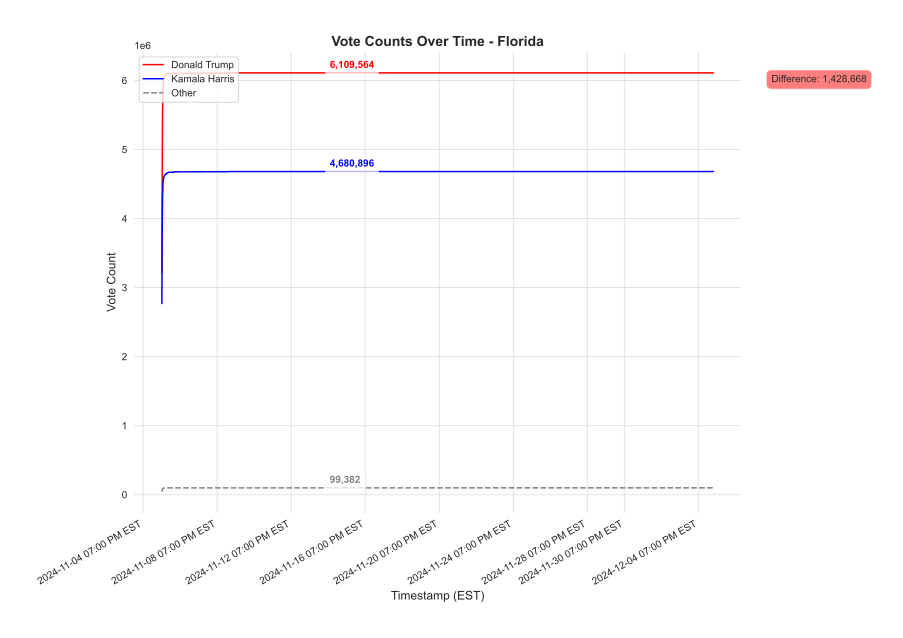

### Georgia
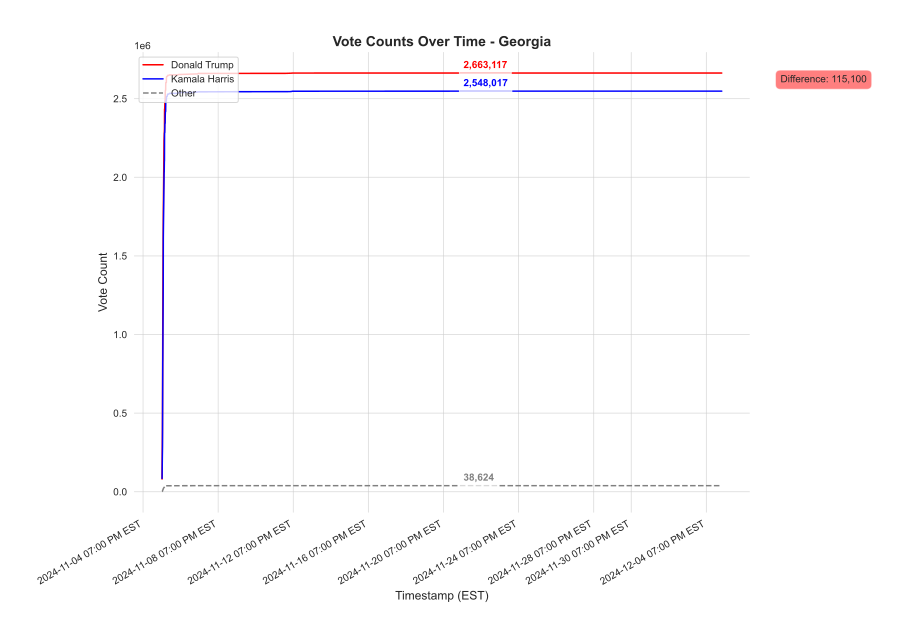

### Hawaii

### Idaho

### Illinois

### Indiana

### Iowa
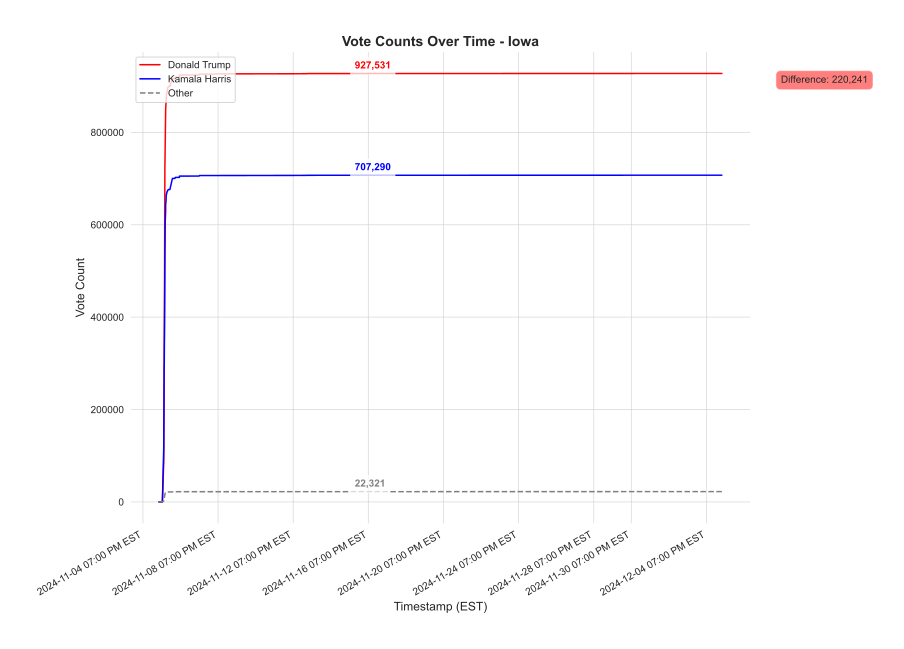

### Kansas

### Kentucky

### Louisiana

### Maine
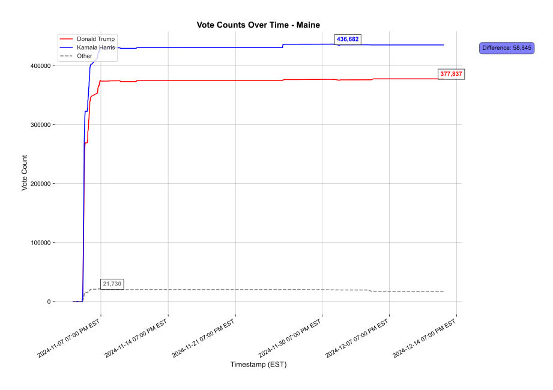

### Maryland

### Massachusetts
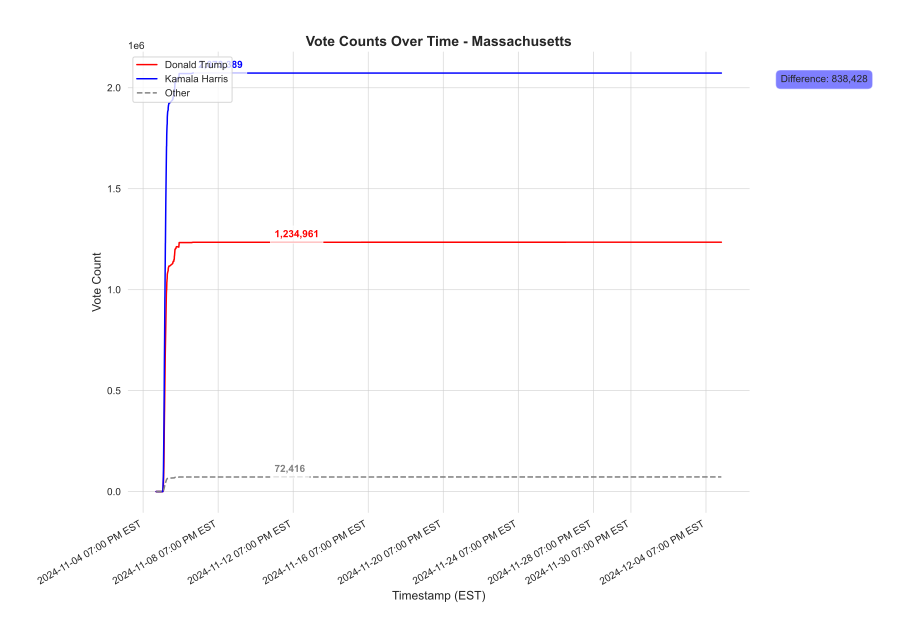

### Michigan

### Minnesota

### Mississippi

### Missouri
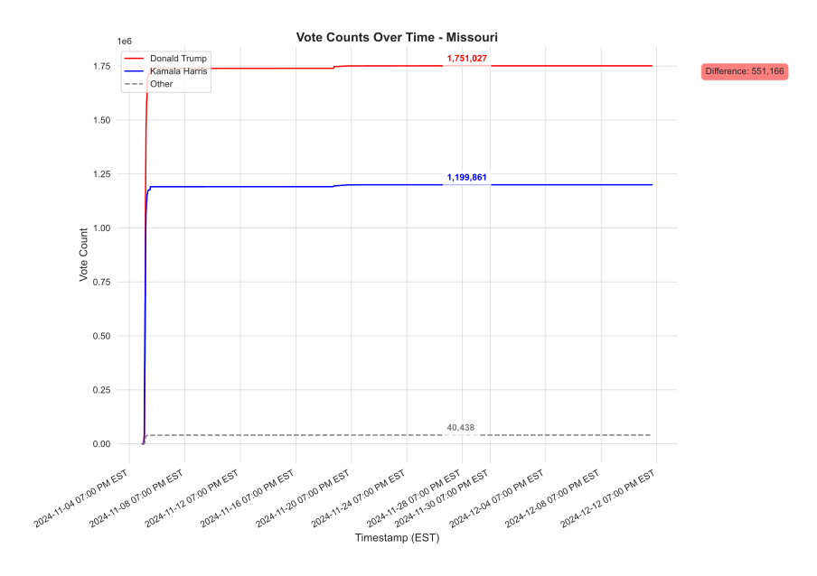

### Montana
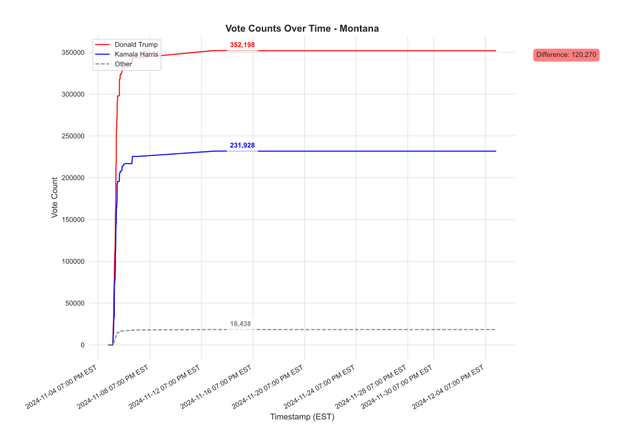

### Nebraska

### Nevada

### New Hampshire

### New Jersey

### New Mexico

### New York

### North Carolina

### North Dakota

### Ohio

### Oklahoma
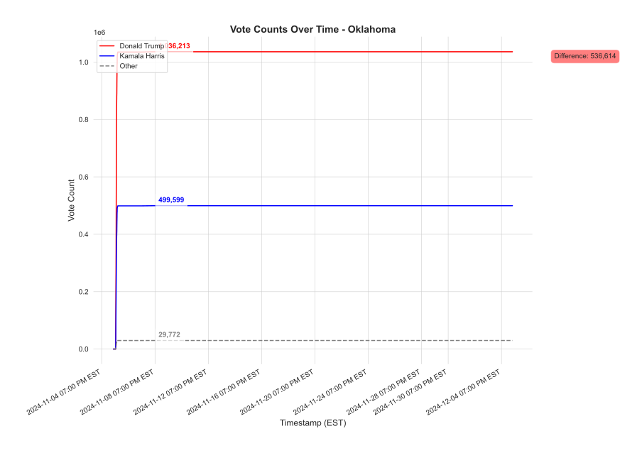

### Oregon

### Pennsylvania

### Rhode Island

### South Carolina

### South Dakota

### Tennessee
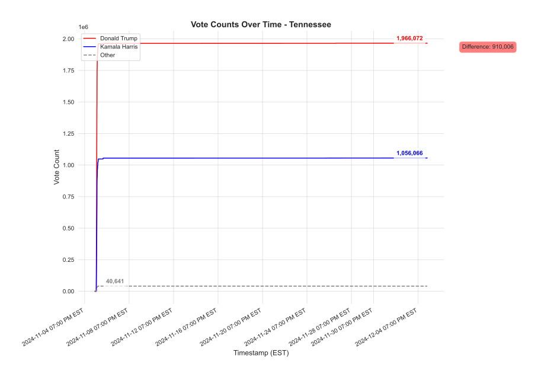

### Texas

### Utah

### Vermont
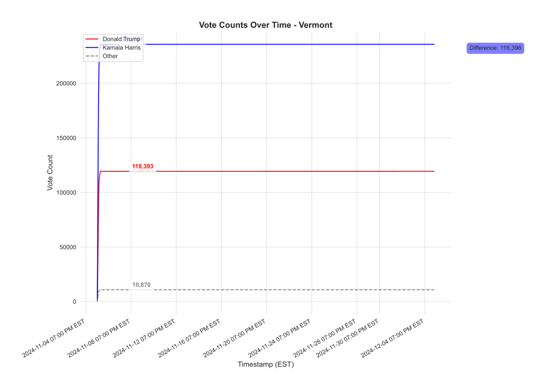

### Virginia
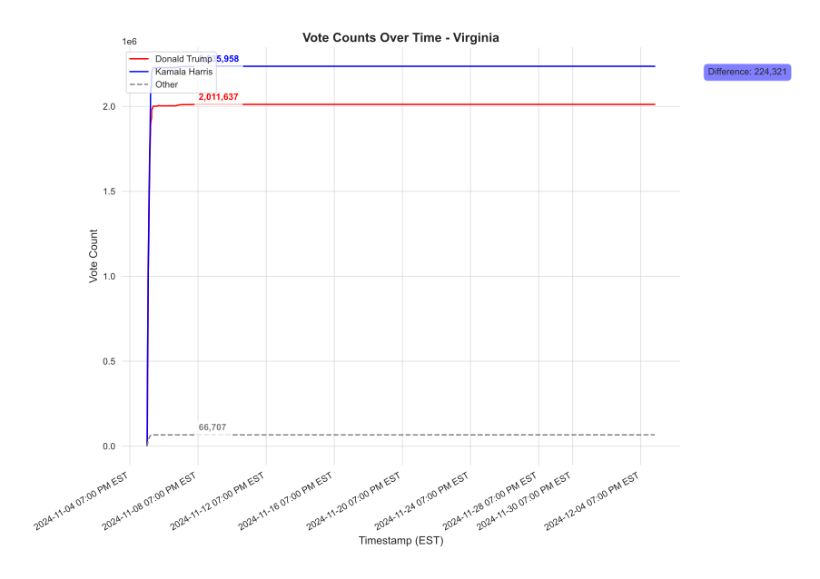

### Washington
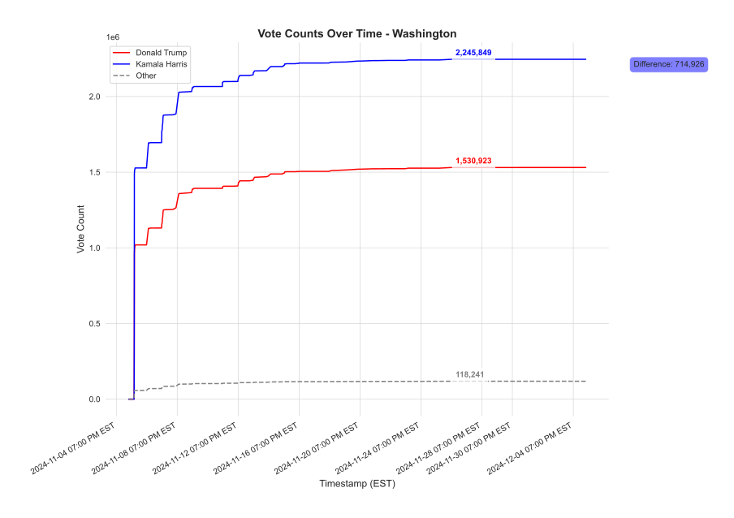

### West Virginia

### Wisconsin

### Wyoming

