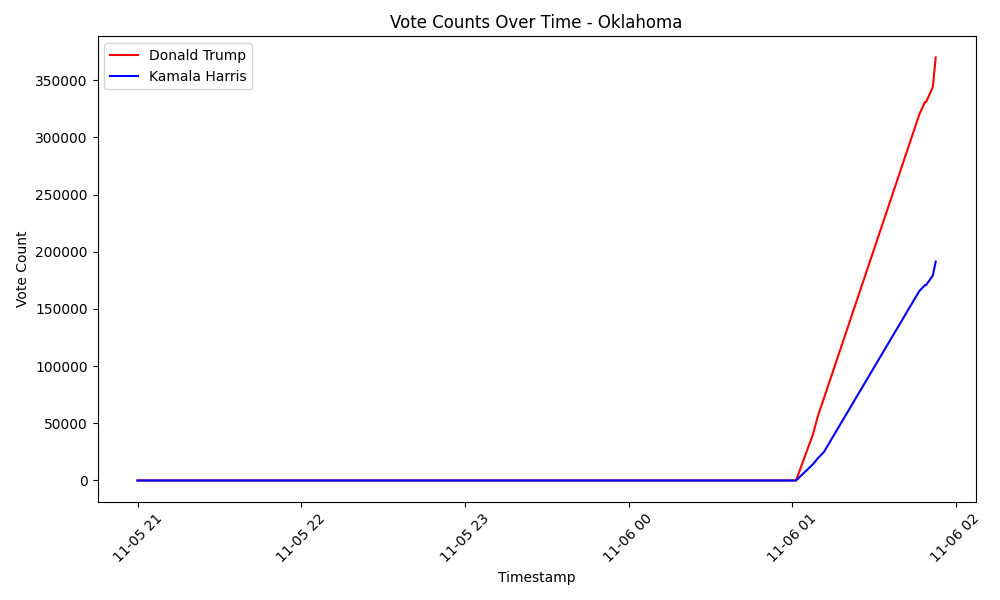

# election-2024-results
Line graphs of all states for the 2024 election.

Simply runs data.py every minute to create a SQLite DB, followed by line_graphs.py every 5 minutes to update images.

## Results

### Alabama

### Alaska

### Arizona

### Arkansas

### California

### Colorado

### Connecticut

### Delaware

### District of Columbia

### Florida

### Georgia

### Hawaii

### Idaho

### Illinois

### Indiana

### Iowa

### Kansas

### Kentucky

### Louisiana

### Maine

### Maryland

### Massachusetts

### Michigan

### Minnesota

### Mississippi

### Missouri

### Montana

### Nebraska

### Nevada

### New Hampshire

### New Jersey

### New Mexico

### New York

### North Carolina

### North Dakota

### Ohio

### Oklahoma

### Oregon

### Pennsylvania

### Rhode Island

### South Carolina

### South Dakota

### Tennessee

### Texas

### Utah

### Vermont

### Virginia

### Washington

### West Virginia

### Wisconsin

### Wyoming

